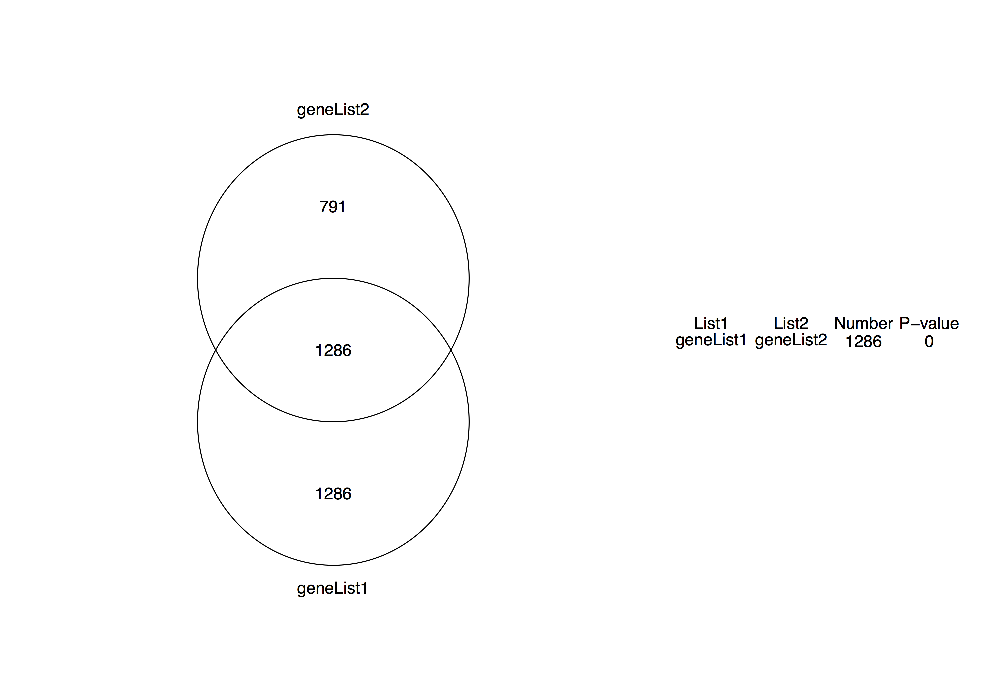
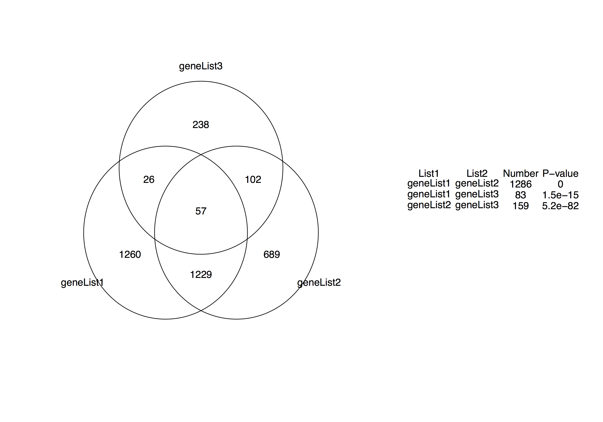
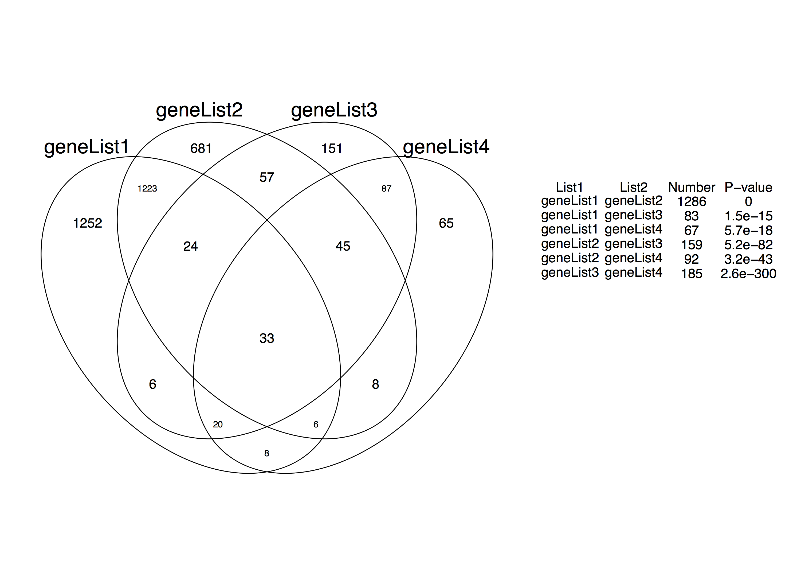

# GeneOverlap Tutorial

### 1. Two gene sets overlap
```
Rscript gene_overlap.R example/geneList1 example/geneList2
```

### 2. Three gene sets overlap
```
Rscript gene_overlap.R example/geneList1 example/geneList2 example/geneList3
```

### 3. Four gene sets overlap
```
Rscript gene_overlap.R example/geneList1 example/geneList2 example/geneList3 example/geneList4
```



